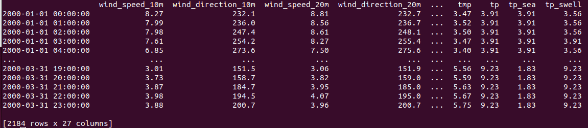

.. metocean-api documentation master file, created by
   sphinx-quickstart on Thu Sep 14 10:18:36 2023.
   You can adapt this file completely to your liking, but it should at least
   contain the root `toctree` directive.

Welcome to metocean-api's documentation!
=====================================

**metocean-api** is a Python tool to extract time series of metocean data from global/regional/coastal hindcasts/reananalysis.

The package contains functions to extract time series to csv-format from:
  * `NORA3`_ hindcast dataset 
  * ...

.. _NORA3: https://marine.met.no/node/19

Installing **metocean-api**
=============================================
1. Install anaconda3 or miniconda3
2. Clone metocean-api:

.. code-block:: bash

   $ git clone https://github.com/MET-OM/metocean-api.git
   $ cd metocean-api/

3. Create environment with the required dependencies and install metocean-api

.. code-block:: bash

  $ conda config --add channels conda-forge
  $ conda env create -f environment.yml
  $ conda activate metocean-api
  $ pip install --no-deps -e .

Creating a TimeSeries-object
=====================================
This section documents the **ts-module**. The ts-object is initialized with the following command:

.. code-block:: python

   from metocean_api import ts
   df_ts = ts.TimeSeries(lon=1.320, lat=53.324,
                      start_time='2000-01-01', end_time='2000-03-31' , 
                      product='NORA3_wind_wave') 

Several options for **product** are available. Please check the data catalog for the time coverage:

.. code-block:: bash
  
  * For wind NORA3 sub data (Nordic Seas): product='NORA3_wind_sub'
    Data catalog: https://thredds.met.no/thredds/catalog/nora3_subset_atmos/wind_hourly/catalog.html
  * For wave NORA3 sub data (Nordic Seas): product='NORA3_wave_sub' 
    Data catalog: https://thredds.met.no/thredds/catalog/nora3_subset_wave/wave_tser/catalog.html
  * For combined wind and wave NORA3 sub data: product='NORA3_wind_wave'
  * For wave NORA3 data (Nordic Seas + Arctic): product='NORA3_wave'
    Data catalog: https://thredds.met.no/thredds/catalog/windsurfer/mywavewam3km_files/catalog.html
  * For coastal wave NORA3 data: product='NORAC_wave'
    Data catalog: https://thredds.met.no/thredds/catalog/norac_wave/field/catalog.html

    

Import data from server to **ts-object** and save it as csv:

.. code-block:: python

   df_ts.import_data(save_csv=True)

Data is saved in:

.. code-block:: python

   print(df_ts.datafile) #'NORA3_wind_wave_lon1.32_lat53.324_19890101_20221231.csv' 

To import data from a local csv-file to **ts-object**:

.. code-block:: python

   df_ts.load_data(local_file=df_ts.datafile)  
   print(df_ts.data)

.. toctree::
   :maxdepth: 2
   :caption: Contents:
